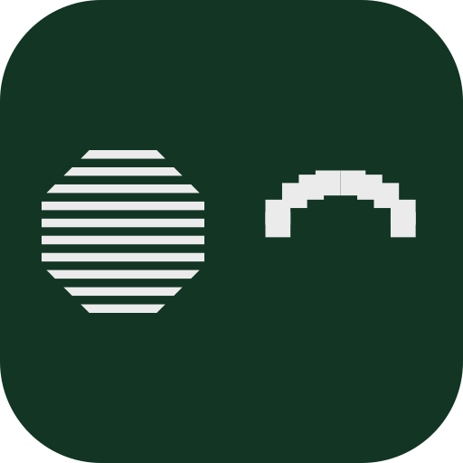

<p align="center">
  <a href="https://tokens.smold.app">
    
  </a>
</p>

<h1 align="center">Token Assets</h1>

<p align="center">
  One open-source CDN for cryptocurrency token and network logos.
</p>

<p align="center">
  <a href="https://tokens.smold.app"><strong>Browse tokens</strong></a>
  ·
  <a href="https://tokens.smold.app/submit"><strong>Submit a token</strong></a>
  ·
  <a href="https://assets.smold.app"><strong>CDN</strong></a>
</p>

This repository powers [tokens.smold.app](https://tokens.smold.app), where you can search the collection, preview every logo, copy asset URLs, and submit missing tokens. Assets are available as SVG and PNG through a stable URL, with no API key required.

## Quick start

### Token logos

```text
https://assets.smold.app/token/{chainID}/{tokenAddress}/{fileName}
```

For example, USDC on Ethereum:

```html

```

### Network logos

```text
https://assets.smold.app/chain/{chainID}/{fileName}
```

For example:

```text
https://assets.smold.app/chain/1/logo-128.png
```

### Available files

| File           | Best for                                      |
| -------------- | --------------------------------------------- |
| `logo-32.png`  | Compact lists and small icons                 |
| `logo-128.png` | Most app interfaces and high-density displays |
| `logo.svg`     | Larger sizes and vector rendering             |

For most interfaces, use PNG: its dimensions and rendering cost are predictable. Choose the 32 px version when it will be displayed at 32 px or less, and the 128 px version everywhere else.

## Find an asset

Visit [tokens.smold.app](https://tokens.smold.app) to search by token name, symbol, address, or network. The network selector contains the current list of supported chains.

Repository paths follow the same structure as CDN URLs:

```text
tokens/{chainID}/{tokenAddress}/
chains/{chainID}/
```

EVM token directories use lowercase addresses. Solana addresses are case-sensitive.

## Add or update a token

The easiest route is the [submission form](https://tokens.smold.app/submit):

1. Sign in with GitHub.
2. Select the network and enter the token details.
3. Upload a vector SVG logo.
4. Submit the form.

The site validates the SVG, creates both PNG sizes, and opens a pull request for review.

<details>
<summary><strong>Submit manually</strong></summary>

1. Fork this repository.
2. Create `tokens/{chainID}/{tokenAddress}/`.
3. Add `logo.svg`, `logo-32.png`, and `logo-128.png`.
4. Open a pull request and complete the checklist.

SVG files must be pure vector, smaller than 150 KB, and contain no scripts, external links, or embedded raster images. Your project website or documentation must clearly display the token address.

You can generate the PNG files with [Inkscape](https://inkscape.org):

```bash
inkscape -w 32 -h 32 logo.svg -o logo-32.png
inkscape -w 128 -h 128 logo.svg -o logo-128.png
```

Or with [`rsvg-convert`](https://formulae.brew.sh/formula/librsvg):

```bash
rsvg-convert -w 32 -h 32 logo.svg > logo-32.png
rsvg-convert -w 128 -h 128 logo.svg > logo-128.png
```

</details>

## Repository structure

```text
tokens/             Token logos, grouped by chain and address
chains/             Network logos, grouped by chain ID
_config/goAPI/      Go CDN server
_config/nodeAPI/    Next.js CDN server
_config/ui/         tokens.smold.app web app
```

## Self-hosting

Two CDN server implementations are included in `_config`:

-   `goAPI` is a lightweight Go server that redirects asset requests to the repository CDN.
-   `nodeAPI` is a Next.js server suitable for platforms such as Vercel.

<details>
<summary><strong>Vercel configuration</strong></summary>

```text
Framework Preset: Next.js
Build Command: yarn --cwd _config/nodeAPI run build
Output Directory: _config/nodeAPI/.next
Install Command: yarn install && yarn --cwd _config/nodeAPI install
Development Command: yarn --cwd _config/nodeAPI dev
Environment Variables: None
```

</details>

## License

[MIT](./LICENSE) © Smol
